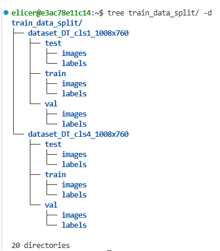

# 데이터 전처리

이 프로그램은 리눅스 환경에서 aihub 데이터를 받고 cocodata set을 변환한다.


사용한 데이터 : [실내 자율주차용 데이터]


## 설치 및 환경 구성
``` shell
python -m venv down_env
source down_env/bin/activate

pip install -r requirements.txt

# 환경 나가기
deactivate
```

## 실행 순서
``` shell
python aihub_down.py

```

## 결과물



[실내 자율주차용 데이터]: https://aihub.or.kr/aihubdata/data/view.do?pageIndex=1&currMenu=115&topMenu=100&srchOptnCnd=OPTNCND001&searchKeyword=%EC%8B%A4%EB%82%B4&srchDetailCnd=DETAILCND001&srchOrder=ORDER001&srchPagePer=20&srchDataRealmCode=REALM003&aihubDataSe=data&dataSetSn=71576